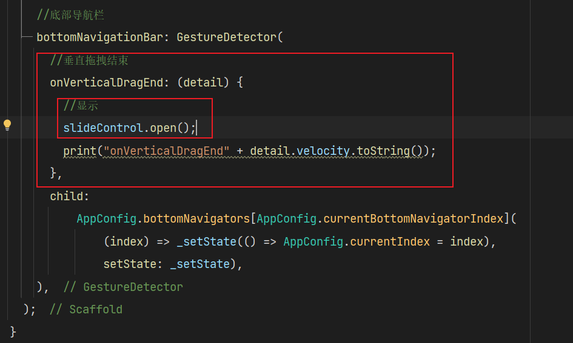

## iTV应用

### 说明
本应用开发模版来自flutter_all_app_template

### 项目架构


### 适用平台
* Android
* IOS
* PC：Windows and Macos
* web
* Ipad
* Embeding嵌入式

### 工程目录

```sh
├─.dart_tool
├─.idea
├─android                  ——————Android平台相关代码
├─assets                   ——————资源文件：img，font等
├─ios                      ——————IOS平台相关代码
├─lib                      ——————开发目录：flutter相关代码
│  ├─common                .........一些工具类，如通用方法类、网络接口类、保存全局变量的静态类等
│  ├─api                   .........api请求目录
│  ├─l10n                  .........国际化相关的类都在此目录下
│  ├─Layouts               .........App布局类都在此目录下
│  ├─boot                  .........各个平台启动目录
│  ├─models                .........Dart Model类会在此目录下
│  ├─config                .........配置文件目录
│  ├─pages                 .........页面存储目录：主要是构建App所需要的页面
│  ├─routes                .........存放所有路由页面类
│  ├─states                .........保存APP中需要跨组件共享的状态类
│  ├─widgets               .........APP内封装的一些Widget组件都在该目录下
│  └─main.dart             .........入口文件
├─linux                    ——————Linux平台相关代码
├─macos                    ——————MACOS平台相关代码
├─test                     ——————用于存放测试代码
├─web                      ——————Web平台相关代码
├─windows                  ——————Windows平台代码
├─analysis_options.yaml    ——————分析dart语法的文件，老项目升级成新项目有警告信息的话可以删掉此文件
└─pubspec.yaml             ——————配置文件，一般存放一些第三方库的依赖。
```

### 更新日志：

- 2024.1.6 增加了notification本地化通知插件，并且进行了工具类封装,以及主题插件配置

- 2024.1.7 增加下拉刷新以及微光效果，修改目录结构,以及登录注册页面

- 2024.1.24 fix bottom sheet to gesture

  

- 2024.1.28 add flutter embeding to Raspberry and exception catched handler

